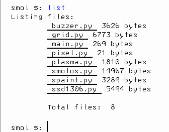
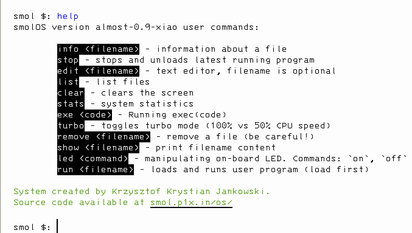

# smolOS
## Specialized Microcontroller-Oriented Lightweight Operating System

**smolOS** is a tiny (<20KB, <500LOC) and simple 🧪 research ⚙️ operating system ⌨️ written in 🐍 MicroPython for microcontrollers giving user a POSIX-like 📁 environment to play. It came with a set of 🧰 tools and 🪄 demos.

System should run on any MicroPython supproted board but it's tested and developed on Seeed XIAO RP2040,

### Official homepage:
- [smol.p1x.in/os/ (http)](http://smol.p1x.in/os/)
- [smol.p1x.in/os/ (https)](https://smol.p1x.in/os/)


### Real Life Usecases

* listing and removing unwanted files on board
* checking free space
* easy way to write simple programs and run them from the OS
* quicly iterating parameters for a program
* editing small bugs in programs
* having fun with microcontrollers

### smolOS Features

* Changes microcontroller into a small working PC
* Homemade for fun and learning
* Super small and fast
* Easy to use, simillar to MS-DOS, POSIX-like environments
* List and manipulates files
* Text editor included (very basic but capabe)
* Basic tools and demos included (for NeoPixels, Buzzers, LEDs)
* Build on MicroPython with clear code
* Stability and simplicity are the main principle behind the code
* Free and open :)

### Additoinal Programs

* ansi - Displays ANSI escape codes
* life - Game of Life implementation for smolOS (text)
* buzz - Simple synthezator for 1-bit music (requies a buzzer)

All of those are for NeoPixel Grid 5x5 BFF:
* duck - Yellow Rubber Duck for programmers
* neolife - Game of Life implementation
* pixel - Tools for playing with one LED
* plasma - Demoscene plasma effect
* font - Font bitmaps (for scroller)
* scroller - Scrolls text


## Installation

### Super Quick Quide
* put main system file ```smolos.py``` onto the board flash (that has latest MicroPython firmware)
* (optional) for auto-boot copy ```main.py``` too
* restart device

### Detailed Guides
* [XIAO RP2040 Guide](docs/XIAO-RP2040.md)
* [ESP8266 Guide](docs/ESP8266.md)

## Connecting
As normal user:

```
$ picocom /dev/ttyACM0
```
Press ```ctrl+a+x``` to exit.

## Running

First start. Or after flashing new main.py file. Restart the microcontroller:
```
>>> machine.soft_reset()
```

### Autoboot
This should restart the device and "boot" you into the smolOS. Like so:


### Manual
If you put ```smolos.py``` then you need to boot the system by hand.
In MicroPython REPL write:
```
>>> from smolos import smolOS
>>> os = smolOS()
>>> os.boot()
```

## Using

Write `help` for manual :)






## Missing Features
Some kind of a roadmap (from high to low priority)
- rename `show` to `print`
- check exception for used core instead of class variable
- os: move/copy files
- edit: jumping to a line
- finalized architecture and user programs structure (version 0.9 will show final vision)
- template for program and expanding os itself
- good manual

## Articles
- [hackster.io](https://www.hackster.io/news/krzysztof-jankowski-s-micropython-based-smolos-puts-a-tiny-posix-like-environment-on-your-esp8266-0c776559152b)
- [cnx-software.com](https://www.cnx-software.com/2023/07/12/smolos-brings-a-linux-like-command-line-interface-to-esp8266-microcontroller/)
- [lobste.rs](https://lobste.rs/s/ipztxc/smolos_small_os_for_micropython_on)

## Intresting forks
- [pegasusOS by 047pegasus](https://github.com/047pegasus/pegasusOS)
- [smolOS by rbenrax](https://github.com/rbenrax/smolOS)
